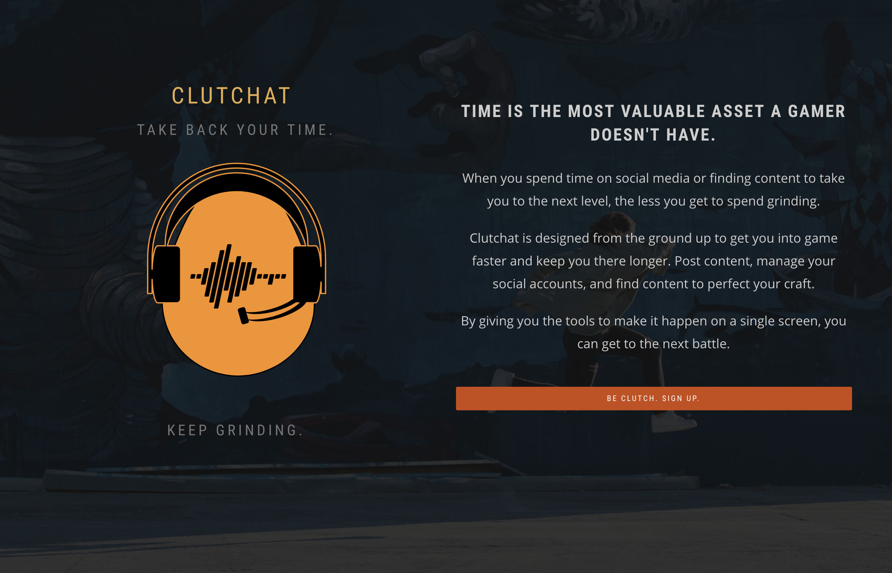

# Clutchat Homepage
Welcome to the official homepage of Clutchat. located at [clutch.im](https://clutch.im). This repository contains all the files used on the current version of the Clutchat website.

## About Us
Gamer Ammo is on a mission of declaration: _Gaming is a Profession_. We are declaring this a fact by building a suite of gaming related software aimed at making the gamer's environment more accessibly to profiting from their profession. This website is the homepage for our flagship product [Clutchat](https://github.com/gamerammo/clutchat), the gamer's hub for chat, content, and finance. We are making this possible by utilizing decentralized peer-to-peer technologies and building the platform gamer-first.

### Decentralized Gaming
When we say we use decentralized technologies, that means we are utilizing the cutting edge of user data management in-order to provide our services to you. We utilized distributed ledger technology, some written by us or others, to provide the gamer the content and the information they say. This provides anonymity, security, and allows us room for innovation. In the event of blockchain technologies, we utilize the [Ethereum Classic](https://github.com/ethereumproject) network.

### What's Here?
In this repository you'll find all the files used on the Clutchat website [clutch.im](https://clutch.im).

### Where's the app?
You can find our code for the Clutchat application in it's own separate github repository, [gamerammo/clutchat](https://github.com/gamerammo/clutchat).

## Documentation
For more information on how to contribute to this repository checkout [CONTRIBUTING.md](docs/CONTRIBUTING.md). There you will find the information needed to begin providing contributions to the Gamer Ammo website

### White Paper
The Gamer Ammo White Paper will be available soon.

### Business Plan
You can find the most recent version of the Gamer Ammo, Inc. Business Plan at the repository [gamerammo/businessplan](https://github.com/gamerammo/businessplan).

### Pitch Deck
Our most recent version of our pitch deck is available at [gamerammo.io/pitch.pdf](https://gamerammo.io/pitch) or in the docs directory of this repository [docs/pitch.pdf](docs/pitch).

### Handbook
The most up-to-date version of the Gamer Ammo, Inc. Employee Handbook is located at the repository [gamerammo/handbook](https://github.com/gamerammo/handbook).

## Join the Movement
We encourage anyone who wants to join our movement to join our [Discord server](https://discord.gg/5wBRPE8). You can also keep up-to-date on what's going on via our [Medium](https://medium.com/gamerammo) publication. For everything else we have: [Twitter](https://twitter.com/gamerammo), [Facebook](https://facebook.com/gamerammo), and [Telegram](https://t.me/joinchat/AAAAAE4MAfKEIr6RT6hVVQ).
